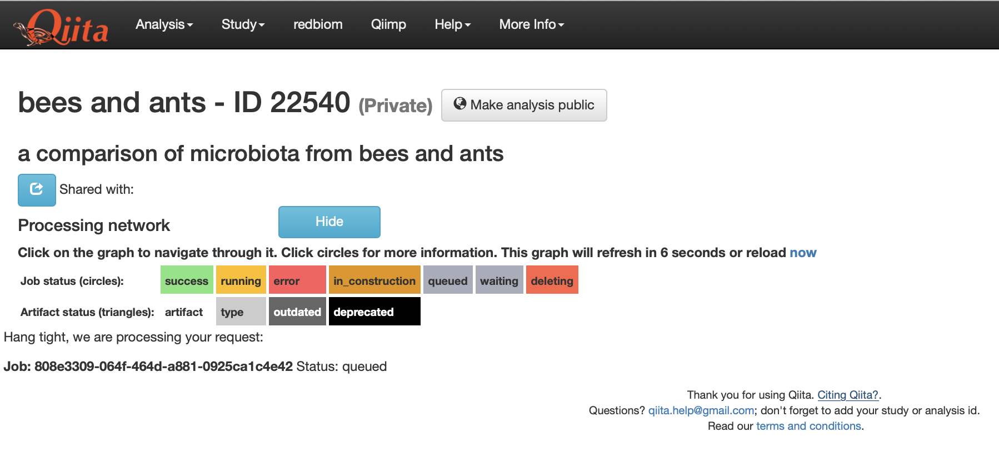

# Metaanalysis in Qiita: quick-start

## Introduction

#### What is Qiita? 

[Qiita](http://qiita.ucsd.edu) is an open-source online repository and analysis tool for microbiome data, created by Antonio Gonzales, Jose Navas-Molina, *et al.* in the [Knight Lab](https://knightlab.ucsd.edu) at UCSD. It's a terrifically useful tool for organizing the first steps of a microbiome analysis, particularly when you want to share data with collaborators or compare data to previous datasets. (You can find the publication describing this tool [here](https://www.nature.com/articles/s41592-018-0141-9)). 

#### What is this document?

This document is more or less a shortcut to certain pieces of existing Qiita documentation, plus a little bit of extra detail for bits that should be particularly useful to you in the Hackathon.

#### Qiita Documentation

Qiita is meant to be an accessible platform for microbiome analysis and exploration, even if you don't have prior experience with bioinformatics or command-line tools. Consequently the developers have put quite a lot of effort into writing documentation. 

After you've walked through this quick-start, if you're interested in working more with Qiita, I'd recommend you more thoroughly explore the existing Qiita docs. 

My recommendation for getting started is to follow the complete [Qiita Workshop Tutorial](https://cmi-workshop.readthedocs.io/en/latest/) from the Center for Microbiom Innovation at UCSD. This tutorial provides a small set of example data you can download, and walks you through step-by-step the creation and analysis of a new study.  

There is additional, more-granular documentation available at the [central Qiita Documentation site](https://qiita.ucsd.edu/static/doc/html/index.html). This includes information on some of Qiita's more advanced features, such as the ability to [easily submit studies](https://qiita.ucsd.edu/static/doc/html/checklist-for-ebi-ena-submission.html) from Qiita to public nucleotide repositories.

## Create an account

To do analyses in Qiita, you'll need to get an account. 

Follow [these instructions](https://cmi-workshop.readthedocs.io/en/latest/qiita-create-study.html#setting-up-qiita) from the CMI Workshop Tutorial to sign up.

## Check out a study

'Studies' form the basis of the Qiita database organization: researchers create a new study, and then upload their data to the study. Initially, studies are private, only viewable by their owner (and any other accounts the owner chooses to share it with). Eventually, users can choose to make these studies public.

If you click `Study / View Studies` in the nav bar at the top of the screen, you'll see a table of your private studies and a table of available public studies:


You can click on one of the example study titles to take a look inside. Here, I've clicked on study #101, "Succession of microbial consortia in the developing infant gu microbiome." This study was performed right here at Cornell!


This study also has a 'Gold' tag, indicating that it has been curated by the Qiita development team as a great example. 

If you'd like to try creating your own test study, try following [the tutorial](https://cmi-workshop.readthedocs.io/en/latest/qiita-create-study.html#studies-in-qiita) from the CMI Workshop docs.

## Find data for a meta-analysis

One of the great things about Qiita is that gives you access to data from hundreds of thousands of samples *that have all been processed the same way*. This makes it really simple to get up and going, without having to worry about downloading all the raw data and running it through your own computational pipeline. (You can also download the raw data if you want!)

There are two ways you can find data for analysis: searching for **studies**, and searching for **samples**.

### Finding studies from the study splash page

The table we just saw listed can be filtered by entering text into the `Filter by column data` search bar at the top of the page. This only searches the data you can read on the public splash page for the study, including the title, abstract, etc. 

For example, I can find a study I did on the gut microbes of ants from the rainforests of Peru by typing 'rainforest ants' into the search bar:


### Finding samples using `redbiom`

In addition to finding complete studies, you can find *individual samples* from among the hundreds of thousands publically available in Qiita. This is a very new addition, and uses a clever search mechanism behind the scenes called `redbiom`. 

The advantage to searching for particular samples is that you can start to explore more targeted questions built directly from data. For example, what if you wanted to compare all the samples that contained a particular microbial taxon, or even a particular 16S sequence? You can find those samples using the `redbiom` search functionality.

To search with `redbiom`, click the corresponding 


#### Finding samples by taxon

Let's say you want to search for all the samples that contain bacteria with a particular taxonomic label. Select 'Taxon' from the dropdown, enter the search term in the box, and click the search button on the right.

This search method uses the GreenGenes taxonomy, so you'll need to prepend the taxon label with the letter corresponding to the taxonomic level followed by two underscores. For example, if I want to search for samples containing bacteria belonging to the family Christensenellaceae, I would search for `f__Christensenellaceae`:


This returns quite a lot of samples!


#### Finding samples by ASV sequence

You can also search for a particular sequence. This allows you to very finely target microbial taxa, even if they don't correspond to particular taxonomic labels. For example, let's say I want to find samples that have close relatives of *Methylocystis parvus*, a methane-oxidizing (methanotrophic) bacterium. 

I can go to NCBI and find the [16S ribsomal RNA gene](https://www.ncbi.nlm.nih.gov/nuccore/NR_044946.1) corresponding to this bacterium. Then I can find the portion of the gene that matches most of the samples in Qiita. This happens to be the V4 region of the 16S rRNA gene. The NCBI 16S rRNA sequence I found is: 

```
>NR_044946.1 Methylocystis parvus OBBP 16S ribosomal RNA, partial sequence
AACGAACGCTGGCGGCAGGCCTAACACATGCAAGTCGAACGCTGTAGCAATACAGAGTGGCAGACGGGTG
AGTAACGCGTGGGAACGTGCCTTTCGGTTCGGAATAACTCAGGGAAACTTGAGCTAATACCGGATACGCC
CTTTGGGGGAAAGATTTATTGCCGAAAGATCGGCCCGCGTCCGATTAGCTAGTTGGTGTGGTAATGGCGC
ACCAAGGCGACGATCGGTAGCTGGTCTGAGAGGATGATCAGCCACACTGGGACTGAGACACGGCCCAGAC
TCCTACGGGAGGCAGCAGTGGGGAATATTGGACAATGGGCGCAAGCCTGATCCAGCCATGCCGCGTGAGT
GATGAAGGCCCTAGGGTTGTAAAGCTCTTTCGCCAGGGACGATAATGACGGTACCTGGATAAGAAGCCCC
GGCTAACTTCGTGCCAGCAGCCGCGGTAATACGAAGGGGGCTAGCGTTGTTCGGAATCACTGGGCGTAAA
GCGCACGTAGGCGGATCTTTAAGTCAGGGGTGAAATCCCGAGGCTCAACCTCGGAACTGCCTTTGATACT
GGAGGTCTCGAGTCCGGGAGAGGTGAGTGGAACTGCGAGTGTAGAGGTGAAATTCGTAGATATTCGCAAG
AACACCAGTGGCGAAGGCGGCTCACTGGCCCGGTACTGACGCTGAGGTGCGAAAGCGTGGGGAGCAAACA
GGATTAGATACCCTGGTAGTCCACGCCGTAAACGATGGATGCTAGCCGTTGGGGAGCATGCTCTTCAGTG
GCGCAGCTAACGCTTTAAGCATCCCGCCTGGGGAGTACGGTCGCAAGATTAAAACTCAAAGGAATTGACG
GGGGCCCGCACAAGCGGTGGAGCATGTGGTTTAATTCGAAGCAACGCGCAGAACCTTACCAGCTTTTGAC
ATGCCCGGTATGATCGCCAGAGATGGCTTTCTTCCCGCAAGGGGCCGGAGCACAGGTGCTGCATGGCTGT
CGTCAGCTCGTGTCGTGAGATGTTGGGTTAAGTCCCGCAACGAGCGCAACCCTCGCCCTTAGTTGCCATC
ATTCAGTTGGGCACTCTAGGGGGACTGCCGGTGATAAGCCGCGAGGAAGGTGGGGATGACGTCAAGTCCT
CATGGCCCTTACAGGCTGGGCTACACACGTGCTACAATGGCGGTGACAATGGGAAGCGAAAGGGCGACCT
GGAGCAAATCTCAAAAAGCCGTCTCAGTTCGGATTGCACTCTGCAACTCGAGTGCATGAAGGTGGAATCG
CTAGTAATCGCAGATCAGCACGCTGCGGTGAATACGTTCCCGGGCCTTGTACACACCGCCCGTCACACCA
TGGGAGTTGGTTTTACCCGAAGGCGTTTCGCCAACCGCAAGGAGGCAGGCGACCACGGTAGGGTCAGCGA
CTGGGGTG
```

For `redbiom`, it's important the portion of our search sequence match *exactly* what's in the database: same start, same end. For most samples, that means selecting the 100 or 150 nucleotides immediately following the Earth Microbiome Project 515f primer, which is: `GTGYCAGCMGCCGCGGTAA`. I can replace the `Y` and `M` degenerate characters with a wildcard (`GTG*CAGC*GCCGCGGTAA`) and find this primer location using a text editor:

```
>NR_044946.1 Methylocystis parvus OBBP 16S ribosomal RNA, partial sequence
AACGAACGCTGGCGGCAGGCCTAACACATGCAAGTCGAACGCTGTAGCAATACAGAGTGGCAGACGGGTG
AGTAACGCGTGGGAACGTGCCTTTCGGTTCGGAATAACTCAGGGAAACTTGAGCTAATACCGGATACGCC
CTTTGGGGGAAAGATTTATTGCCGAAAGATCGGCCCGCGTCCGATTAGCTAGTTGGTGTGGTAATGGCGC
ACCAAGGCGACGATCGGTAGCTGGTCTGAGAGGATGATCAGCCACACTGGGACTGAGACACGGCCCAGAC
TCCTACGGGAGGCAGCAGTGGGGAATATTGGACAATGGGCGCAAGCCTGATCCAGCCATGCCGCGTGAGT
GATGAAGGCCCTAGGGTTGTAAAGCTCTTTCGCCAGGGACGATAATGACGGTACCTGGATAAGAAGCCCC
GGCTAACTTC**GTGCCAGCAGCCGCGGTAA**TACGAAGGGGGCTAGCGTTGTTCGGAATCACTGGGCGTAAA
GCGCACGTAGGCGGATCTTTAAGTCAGGGGTGAAATCCCGAGGCTCAACCTCGGAACTGCCTTTGATACT
GGAGGTCTCGAGTCCGGGAGAGGTGAGTGGAACTGCGAGTGTAGAGGTGAAATTCGTAGATATTCGCAAG
AACACCAGTGGCGAAGGCGGCTCACTGGCCCGGTACTGACGCTGAGGTGCGAAAGCGTGGGGAGCAAACA
GGATTAGATACCCTGGTAGTCCACGCCGTAAACGATGGATGCTAGCCGTTGGGGAGCATGCTCTTCAGTG
GCGCAGCTAACGCTTTAAGCATCCCGCCTGGGGAGTACGGTCGCAAGATTAAAACTCAAAGGAATTGACG
GGGGCCCGCACAAGCGGTGGAGCATGTGGTTTAATTCGAAGCAACGCGCAGAACCTTACCAGCTTTTGAC
ATGCCCGGTATGATCGCCAGAGATGGCTTTCTTCCCGCAAGGGGCCGGAGCACAGGTGCTGCATGGCTGT
CGTCAGCTCGTGTCGTGAGATGTTGGGTTAAGTCCCGCAACGAGCGCAACCCTCGCCCTTAGTTGCCATC
ATTCAGTTGGGCACTCTAGGGGGACTGCCGGTGATAAGCCGCGAGGAAGGTGGGGATGACGTCAAGTCCT
CATGGCCCTTACAGGCTGGGCTACACACGTGCTACAATGGCGGTGACAATGGGAAGCGAAAGGGCGACCT
GGAGCAAATCTCAAAAAGCCGTCTCAGTTCGGATTGCACTCTGCAACTCGAGTGCATGAAGGTGGAATCG
CTAGTAATCGCAGATCAGCACGCTGCGGTGAATACGTTCCCGGGCCTTGTACACACCGCCCGTCACACCA
TGGGAGTTGGTTTTACCCGAAGGCGTTTCGCCAACCGCAAGGAGGCAGGCGACCACGGTAGGGTCAGCGA
CTGGGGTG
```

Finally, I can chop out the 150 characters immediately following the primer sequence:

```
TACGAAGGGGGCTAGCGTTGTTCGGAATCACTGGGCGTAAAGCGCACGTAGGCGGATCTTTAAGTCAGGG
GTGAAATCCCGAGGCTCAACCTCGGAACTGCCTTTGATACTGGAGGTCTCGAGTCCGGGAGAGGTGAGTG
GAACTGCGAG
```

I can then select `Feature` in the drop-down and enter my sequence (all caps, no spaces) and find all the samples where that exact ASV occurs:


One neat thing about this is that most of the studies that have large numbers of samples containing this feature are from freshwater environments, and the particular microbe we used to search was isolated from a freshwater bog. Cool!


#### Finding samples by metadata

Finally, we can search the sample metadata associated with each sample. The syntax for this search is a little complex, so you should refer to the [redbiom documentation](https://qiita.ucsd.edu/static/doc/html/redbiom.html) for more specifics. 

One group of metadata search columns that is really useful for this kind of search corresponds to the [Earth Microbiome Project Ontology](http://www.earthmicrobiome.org/protocols-and-standards/empo/). The EMPO a pretty easily-understood hierarchical organization of sample types we used in the EMP paper. All samples available in Qiita should have EMPO categories associated with them, under the `qiita_empo_1`, `qiita_empo_2`, and `qiita_empo_3` columns. 


So for example, if we wanted to search for freshwater sediments, we could select `Metadata` from the drop-down and use the search query `where qiita_empo_3 == 'Sediment (non-saline)'`:


We can restrict these to only samples that contain 'USA' somewhere in their metadata by using the query `usa where qiita_empo_3 == 'Sediment (non-saline)'`:


## Add data to a meta-analysis

Now that we've found some interesting samples, let's combine them into one dataset we can analyze. 

Because Qiita processes sequence data using standardized parameters, and 'remembers' which parameters were used to produce each data output, it is possible to easily combine samples processed at different times into one meta-analysis. 

[A complete tutorial](https://cmi-workshop.readthedocs.io/en/latest/qiita-16S-analysis.html) on performing analyses, as well as meta-analyses, is available at the CMI Workshop documentation. 

### Selecting samples

Any time you do one of the above search types, you can select samples to add to a meta-analysis by clicking the green + icon in the column labeled 'Expand for analysis'. 

Going back to my ant study from before, if I click the green + icon, I see a list of 10 different artifact types:


Each of these represents an output (BIOM table, or OTU table) of the raw data analyzed using a particular combination of parameters. You'll want to make sure you choose artifacts produced using the same parameter combinations for a metaanalysis, so as not to mix proverbial apples and oranges. 

I'll choose the 'Deblur reference-hit | Trimming length: 100' parameter combination, which uses the Deblur ASV pipeline, selects only the sequences that look like 16S based on a reference database to remove obvious erroneous sequences, and trims the sequence lengths to 100. This represents a parameter combination that will be present across most studies, and so represents a good starting point for metaanalyses.

To add just this BIOM table to my analysis, I'll click the 'Per artifact' button to add just this one artifact, and then click the next button to confirm:


Sometimes a study will have multiple BIOM artifacts using these same parameters, for example if it spans datasets sequenced on multiple sequence runs; in this case, there would be multiple such artifacts in the expanded table. In this case, you could click 'Add all' to add all of these BIOM artifacts from this parameter combination at once. 

Now I'll search the table for 'honey bee' to find bee microbiome samples to compare, and add those:


### Creating the analysis

After I add an artifact, I will see the 'analysis' icon at the top right of the nav bar turn green:


If I click it, it will show me how many studies and samples I have selected:


Next, I can click `Analyis / Create from selected samples` to create a new analysis with all of these samples:


This will bring me to a page that reviews all the different samples I've selected, where I can remove studies if desired (right column), and finally click the green `Create Analysis` button when I'm ready to go forward:


It will then prompt me to give my analysis a name and description:


This sends Qiita the command to start processing the data into a single BIOM artifact for my meta-analysis. Initially, I see this splash page while the command is waiting to run on the server:



Once the server processes the data, I will see an interactive network diagram showing the artifacts available for analysis. In this case, there will actually be two: one BIOM containing all the sequences from both studies, and one containing just the sequences which have been successfully inserted into a microbial phylogenetic tree using the SEPP program.

I can click the artifact and see detailed information. Note that each 'artifact' also contains several files individually-downloadable files. In this case, I've clicked the top artifact icon and can see it contains the biom, a phylogenetic tree, and two html summary documents:


Clicking any of these will cause the file to download to my computer.

If I scroll down, I can also see an interactive summary of the different samples and sequence counts in this artifact. By clicking around, I am able to find that there's a metadata column called `qiita_study_alias` which shows me that I have just over 350 samples from each study:


### Add analysis steps

From here, it is possible to do a number of different analysis steps right on Qiita. For a more complete rundown of the options, check out the [CMI Workshop Tutorial](https://cmi-workshop.readthedocs.io/en/latest/qiita-16S-analysis.html).

Here, I'll just go ahead and add a few steps just to show how it works.

First, I'll click on the artifact I want (making sure it's the one that includes a phylogenetic tree) and click the `Process` button. This brings up a number of possible actions. I'll choose `Rarefy Table` to subset all my samples to the same number of sequences, and choose 5000 sequences per sample:


Next, I'll add a `Beta diversity (phylogenetic)` step to calculate a beta diversiy distance matrix between samples. I'll choose Unweighted UniFrac as my metric, and make sure to choose 'Artifact tree, if it exists' to make sure it uses the phylogenetic tree contained within my artifact:


Finally, I'll add a step to generate a Princple Coordinates Analysis visualization of my beta-diversity distances:


### Run analysis

Note that as each processing step is added, a processing step node (represented by a circle) and an output artifact (represented by a triangle) are each added to the network. Once I'm happy with the steps I've selected, I can click the green `Run` button at the top of the page to send the commands to the server:


Once jobs are running, I can click the icon at top right of the nav bar to get a status report:


As each step finishes, the corresponding command icon in the processing network will change color to indicate the outcome:


Once each step completes, I am able to click on the resulting artifact to see a summary:


